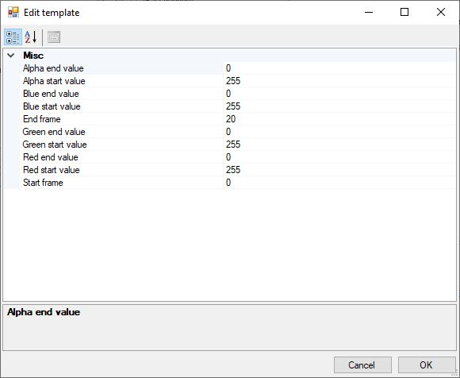
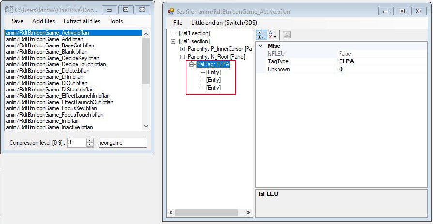
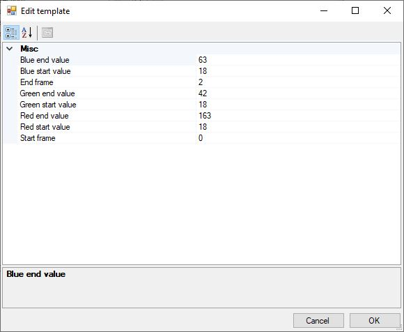
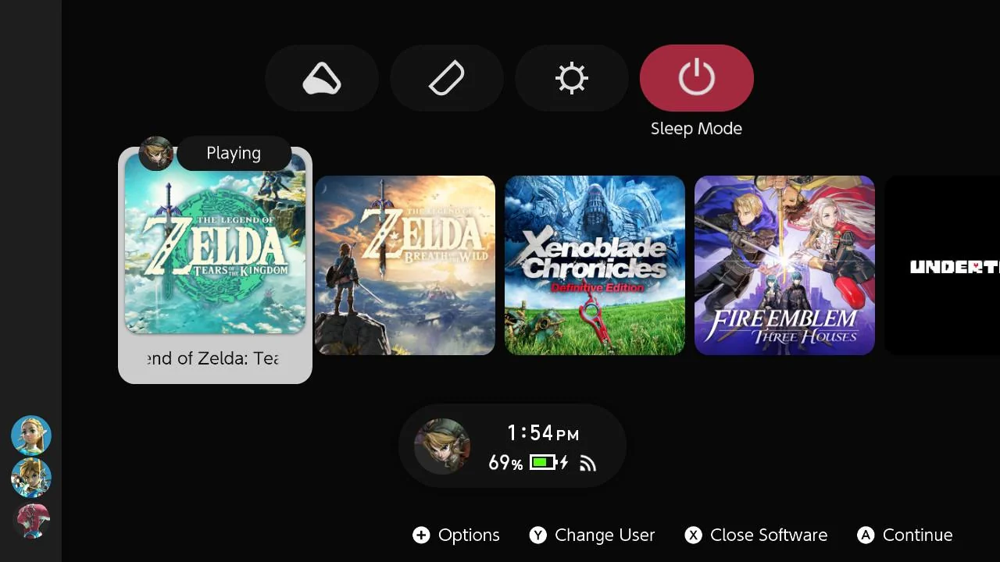

##### :octicons-arrow-left-16: [Back to Animations: main tutorial](main-tutorial.md)

# Animations: bflan templates
---

Layout Editor release 15 has introduced user-defined templates, a very convenient addition that aims to speed up the animation making process which can be very tedious as-is in some specific cases. These templates are especially really useful if you want to make color based animations or have multiple occurrences of the same animation within your theme.

!!! info
        `.bflan` templates were not implemented in the previous releases of Layout Editor. Be sure to grab the latest release.

!!! cite "Check out the tables!"
        In the main tutorial we focused on creating scaling animations that only involved `FLPA` `PaiTag`s and two specific `AnimationTarget` values. Here we will go further using `FLVC` and different `AnimationTarget` values. You might want to check the following tables out and keep them nearby while reading through this section.

        - **[AnimationTargets and PaiTags](./paitags-and-targets.md) :octicons-arrow-right-16:**

## How does it work?

Rather than manually adding entries within `.bflan` files as we did in the main tutorial, we can automate the operation by writing templates instead. It might not be relevant for minor tweaking, but it starts becoming quite necessary for bigger and repetitive tasks.

Each template comes as a pair of two files:

- a `.template` file that defines the actual animation
- a `.json` descriptor that implements the `.template` file and defines properties and variables meant to be used within the `.template` file

Templates must be placed in the `BflanTemplates` folder of your Layout Editor folder.


To get a better grasp, here is the template that the release 15 provides by default:

- `ColorAnimation.template`
```
[
  {
    "Unknown": 0,
    "TagType": "FLVC",
    "Entries": [
      {
        "Index": 0,
        "AnimationTarget": 0,
        "DataType": 2,
        "KeyFrames": [
          { "Frame": %START_FRAME%, "Value": %RED_START_VAL%, "Blend": 0 },
          { "Frame": %END_FRAME%, "Value": %RED_END_VAL%, "Blend": 0 }
        ],
        "FLEUUnknownInt": 0,
        "FLEUEntryName": ""
      },
	  {
        "Index": 0,
        "AnimationTarget": 4,
        "DataType": 2,
        "KeyFrames": [
          { "Frame": %START_FRAME%, "Value": %RED_START_VAL%, "Blend": 0 },
          { "Frame": %END_FRAME%, "Value": %RED_END_VAL%, "Blend": 0 }
        ],
        "FLEUUnknownInt": 0,
        "FLEUEntryName": ""
      },
	  ...
]
```

- `ColorAnimation.json`
```json
{
  "Name": "Animate color RGBA",
  "FileName": "ColorAnimation.template",
  "Target": "PaiEntry",
  "Parameters": [
    {
      "Kind": "Int",
      "Name": "Start frame",
      "Default": "0",
      "Keyword": "%START_FRAME%"
    },
    {
      "Kind": "Int",
      "Name": "End frame",
      "Default": "20",
      "Keyword": "%END_FRAME%"
    },
    ...

  ]
}
```

At this point I hope you see how powerful it is: you can type your entire animation by hand rather than having to do one-by-one operations through Layout Editor's GUI. Indeed, `AnimationTarget` and `KeyFrames` are all defined within `ColorAnimation.template`, and parameters are used (e.g. `%START_FRAME%`, `%RED_START_VAL%`, etc.) to store input values.

We won't discard Layout Editor though, templates are meant to be used with it — that's the main feature of release 15. To load templates, open a `.bflan` and simply right click on the desired `[Pane]` entry and hover `Insert template`. This will show a dropdown list containing your templates, in this case `Animate color RGBA` as per the `FileName` in the `.json` descriptor. Select your template.


A new window will open, containing entries that reflect what is defined in `ColorAnimation.template`. Values in there are editable.



Make your adjustments if needed, confirm and your animation should be created.


We will see more in-depth examples in the following sections.

## 1st example: one animation pattern

Let's say I want to animate my game icons. I want this animation to apply for the game icons in both `ResidentMenu.szs` (home screen) and `Flaunch.szs` (all apps), but I don't want to go through the exact same process of manually creating entries within the `.bflyt` multiple times. That's where templates come in handy.

I'll purposely choose a "complex" animation pattern so we can really see how convenient templates are.

Here is how I want to set it up:

- the icon should go upward by `20px` relative to its base position, taking `4` frames
- the icon should *then* scale up by a `1.04` factor, taking `2` frames

Hence we will need to use the following values of `PaiTag` and `AnimationTarget`:

```
📜RdtBtnIconGame_Active.bflan (ResidentMenu.szs)
 ┣ PaiTag: FLPA
   ┗ AnimationTarget: 1 (y-axis position)
   ┗ AnimationTarget: 6 (x-axis scale)
   ┗ AnimationTarget: 7 (y-axis scale) 
```

```
📜FlcBtnIconGame_Active.bflan (Flauncher.szs)
 ┣ PaiTag: FLPA
   ┗ AnimationTarget: 1 (y-axis position)
   ┗ AnimationTarget: 6 (x-axis scale)
   ┗ AnimationTarget: 7 (y-axis scale) 
```

This is how the template looks like:

- **`gameIcon.template`**
```
[
  {
    "Unknown": 0,
    "TagType": "FLPA",
    "Entries": [
      {
        "Index": 0,
        "AnimationTarget": 1,
        "DataType": 2,
        "KeyFrames": [
          { "Frame": %START_FRAME_POSITION%, "Value": %BASE_POSITION%, "Blend": 0 },
          { "Frame": %END_FRAME_POSITION%, "Value": %POSITION_OFFSET%, "Blend": 0 }
        ],
        "FLEUUnknownInt": 0,
        "FLEUEntryName": ""
      },
      {
        "Index": 0,
        "AnimationTarget": 6,
        "DataType": 2,
        "KeyFrames": [
          { "Frame": %START_FRAME_SCALE%, "Value": %BASE_SCALE%, "Blend": 0 },
          { "Frame": %END_FRAME_SCALE%, "Value": %SCALE_FACTOR%, "Blend": 0 }
        ],
        "FLEUUnknownInt": 0,
        "FLEUEntryName": ""
      },
      {
        "Index": 0,
        "AnimationTarget": 7,
        "DataType": 2,
        "KeyFrames": [
          { "Frame": %START_FRAME_SCALE%, "Value": %BASE_SCALE%, "Blend": 0 },
          { "Frame": %END_FRAME_SCALE%, "Value": %SCALE_FACTOR%, "Blend": 0 }
        ],
        "FLEUUnknownInt": 0,
        "FLEUEntryName": ""
      }
    ]
  }
]
```

- **`gameIcon.json`**
```json
{
  "Name": "Game icon animation",
  "FileName": "gameIcon.template",
  "Target": "PaiEntry",
  "Parameters": [
    {
      "Kind": "Int",
      "Name": "(offset anim) starts at frame",
      "Default": "0",
      "Keyword": "%START_FRAME_POSITION%"
    },
    {
      "Kind": "Int",
      "Name": "(offset anim) ends at frame",
      "Default": "4",
      "Keyword": "%END_FRAME_POSITION%"
    },
    {
      "Kind": "Int",
      "Name": "(scale anim) starts at frame",
      "Default": "4",
      "Keyword": "%START_FRAME_SCALE%"
    },
    {
      "Kind": "Int",
      "Name": "(scale anim) ends at frame",
      "Default": "6",
      "Keyword": "%END_FRAME_SCALE%"
    },
    {
      "Kind": "Int",
      "Name": "Base position",
      "Default": "0",
      "Keyword": "%BASE_POSITION%"
    },
    {
      "Kind": "Int",
      "Name": "Base position offset",
      "Default": "20",
      "Keyword": "%POSITION_OFFSET%"
    },
    {
      "Kind": "Int",
      "Name": "Base scale",
      "Default": "1",
      "Keyword": "%BASE_SCALE%"
    },
    {
      "Kind": "Float",
      "Name": "Scaling factor",
      "Default": "1.04",
      "Keyword": "%SCALE_FACTOR%"
    }
  ]
}
```

Please take those as general principles:

- All the values of interest (i.e. that will determine how the animation actually looks) are stored in parameters: `%START_FRAME_POSITION%`, `%END_FRAME_POSITION%`, `%START_FRAME_SCALE%`, `%END_FRAME_SCALE%`, `%BASE_POSITION%`, `%POSITION_OFFSET%`, `%BASE_SCALE%`, `%SCALE_FACTOR%`
- In the `.json` descriptor, parameters' value type (specified by `Kind`) must be defined accordingly: `Int` (integer), `Float` (real number), `String` (text)
- Each defined parameter within the `.template` has its own entry in the `.json` descriptor. For example:
    - **`%SCALE_FACTOR%`** :octicons-arrow-right-16:
        ```json
        {
          "Kind": "Float",
          "Name": "Scaling factor",
          "Default": "1.04",
          "Keyword": "%SCALE_FACTOR%"
        }
        ```

!!! tip
    - My personal recommendation is typing the `.template` first so you can properly set up your parameters in the `.json` afterwards
    - You can name parameters to your convenience, just enclose them with `%` symbols
    - Adding more keyframes is possible by simply expanding the `KeyFrames` array for the `AnimationTarget` of your choice within the `.template`:
        ```
        { "Frame": %FRAME_ONE%, "Value": %VALUE_ONE%, "Blend": 0 },
        { "Frame": %FRAME_TWO%, "Value": %VALUE_TWO%, "Blend": 0 },
        { "Frame": %FRAME_THREE%, "Value": %VALUE_THREE%, "Blend": 0 },
        { "Frame": %FRAME_FOUR%, "Value": %VALUE_FOUR%, "Blend": 0 },
        ...
        ```

We can proceed on loading this new template onto Layout Editor and finally testing on console. I will add this animation pattern to `RdtBtnIconGame_Active.bflan` and `FlcBtnIconGame_Active.bflan` from `ResidentMenu.szs` and `Flauncher.szs` respectively.




## 2nd example: color based animations

!!! info
        For more details about colors, see the following section:
        
        - **[PaiTags and Targets - FLVC (Vertex Color)](paitags-and-targets.md#flvc-vertex-color) :octicons-arrow-right-16:**

At this point you know pretty much everything about `.bflan` templates. In this section I'll just show you how it applies to color based animations.

Let's say I want to change the background color of the home menu Sleep Mode button when it is selected. Here is how I choose to set up this animation:

- the background transitions from `rgb(18, 18, 18)` (dark gray) to `rgb(163, 42, 63)` (crimson red)
- the transition duration is `2` frames

This time around, `PaiTag` and `AnimationTarget`s are the following:

```
📜RdtBtnPow_Active.bflan (ResidentMenu.szs)
 ┣ PaiTag: FLVC
   ┗ AnimationTarget: 0 (red, top left)
   ┗ AnimationTarget: 1 (green, top left)
   ┗ AnimationTarget: 2 (blue, top left)
   ┗ AnimationTarget: 4 (red, top right)
   ┗ AnimationTarget: 5 (green, top right)
   ┗ AnimationTarget: 6 (blue, top right) 
   ┗ AnimationTarget: 8 (red, bottom left)
   ┗ AnimationTarget: 9 (green, bottom left)
   ┗ AnimationTarget: 10 (blue, bottom left) 
   ┗ AnimationTarget: 12 (red, bottom right)
   ┗ AnimationTarget: 13 (green, bottom right)
   ┗ AnimationTarget: 14 (blue, bottom right) 
```

!!! info
    You might notice that `AnimationTarget` = `3`, `7`, `11`, `15` are missing. These values are used for transparency which I'm not interested in here. Refer to the [tables](./paitags-and-targets.md) for more details.

We will make some adjustments to the pre-configured template that Layout Editor 15 provides by default:

- **`ColorAnimation.template`**
```
[
  {
    "Unknown": 0,
    "TagType": "FLVC",
    "Entries": [
      {
        "Index": 0,
        "AnimationTarget": 0,
        "DataType": 2,
        "KeyFrames": [
          { "Frame": %START_FRAME%, "Value": %RED_START_VAL%, "Blend": 0 },
          { "Frame": %END_FRAME%, "Value": %RED_END_VAL%, "Blend": 0 }
        ],
        "FLEUUnknownInt": 0,
        "FLEUEntryName": ""
      },
      {
        "Index": 0,
        "AnimationTarget": 1,
        "DataType": 2,
        "KeyFrames": [
          { "Frame": %START_FRAME%, "Value": %GREEN_START_VAL%, "Blend": 0 },
          { "Frame": %END_FRAME%, "Value": %GREEN_END_VAL%, "Blend": 0 }
        ],
        "FLEUUnknownInt": 0,
        "FLEUEntryName": ""
      },
      {
        "Index": 0,
        "AnimationTarget": 2,
        "DataType": 2,
        "KeyFrames": [
          { "Frame": %START_FRAME%, "Value": %BLUE_START_VAL%, "Blend": 0 },
          { "Frame": %END_FRAME%, "Value": %BLUE_END_VAL%, "Blend": 0 }
        ],
        "FLEUUnknownInt": 0,
        "FLEUEntryName": ""
      },
	    {
        "Index": 0,
        "AnimationTarget": 4,
        "DataType": 2,
        "KeyFrames": [
          { "Frame": %START_FRAME%, "Value": %RED_START_VAL%, "Blend": 0 },
          { "Frame": %END_FRAME%, "Value": %RED_END_VAL%, "Blend": 0 }
        ],
        "FLEUUnknownInt": 0,
        "FLEUEntryName": ""
      },
      {
        "Index": 0,
        "AnimationTarget": 5,
        "DataType": 2,
        "KeyFrames": [
          { "Frame": %START_FRAME%, "Value": %GREEN_START_VAL%, "Blend": 0 },
          { "Frame": %END_FRAME%, "Value": %GREEN_END_VAL%, "Blend": 0 }
        ],
        "FLEUUnknownInt": 0,
        "FLEUEntryName": ""
      },
      {
        "Index": 0,
        "AnimationTarget": 6,
        "DataType": 2,
        "KeyFrames": [
          { "Frame": %START_FRAME%, "Value": %BLUE_START_VAL%, "Blend": 0 },
          { "Frame": %END_FRAME%, "Value": %BLUE_END_VAL%, "Blend": 0 }
        ],
        "FLEUUnknownInt": 0,
        "FLEUEntryName": ""
      },
	    {
        "Index": 0,
        "AnimationTarget": 8,
        "DataType": 2,
        "KeyFrames": [
          { "Frame": %START_FRAME%, "Value": %RED_START_VAL%, "Blend": 0 },
          { "Frame": %END_FRAME%, "Value": %RED_END_VAL%, "Blend": 0 }
        ],
        "FLEUUnknownInt": 0,
        "FLEUEntryName": ""
      },
      {
        "Index": 0,
        "AnimationTarget": 9,
        "DataType": 2,
        "KeyFrames": [
          { "Frame": %START_FRAME%, "Value": %GREEN_START_VAL%, "Blend": 0 },
          { "Frame": %END_FRAME%, "Value": %GREEN_END_VAL%, "Blend": 0 }
        ],
        "FLEUUnknownInt": 0,
        "FLEUEntryName": ""
      },
      {
        "Index": 0,
        "AnimationTarget": 10,
        "DataType": 2,
        "KeyFrames": [
          { "Frame": %START_FRAME%, "Value": %BLUE_START_VAL%, "Blend": 0 },
          { "Frame": %END_FRAME%, "Value": %BLUE_END_VAL%, "Blend": 0 }
        ],
        "FLEUUnknownInt": 0,
        "FLEUEntryName": ""
      },
	    {
        "Index": 0,
        "AnimationTarget": 12,
        "DataType": 2,
        "KeyFrames": [
          { "Frame": %START_FRAME%, "Value": %RED_START_VAL%, "Blend": 0 },
          { "Frame": %END_FRAME%, "Value": %RED_END_VAL%, "Blend": 0 }
        ],
        "FLEUUnknownInt": 0,
        "FLEUEntryName": ""
      },
            {
        "Index": 0,
        "AnimationTarget": 13,
        "DataType": 2,
        "KeyFrames": [
          { "Frame": %START_FRAME%, "Value": %GREEN_START_VAL%, "Blend": 0 },
          { "Frame": %END_FRAME%, "Value": %GREEN_END_VAL%, "Blend": 0 }
        ],
        "FLEUUnknownInt": 0,
        "FLEUEntryName": ""
      },
      {
        "Index": 0,
        "AnimationTarget": 14,
        "DataType": 2,
        "KeyFrames": [
          { "Frame": %START_FRAME%, "Value": %BLUE_START_VAL%, "Blend": 0 },
          { "Frame": %END_FRAME%, "Value": %BLUE_END_VAL%, "Blend": 0 }
        ],
        "FLEUUnknownInt": 0,
        "FLEUEntryName": ""
      }
    ]
  }
]
```

- **`ColorAnimation.json`**
```json
{
  "Name": "Animate color RGBA",
  "FileName": "ColorAnimation.template",
  "Target": "PaiEntry",
  "Parameters": [
    {
      "Kind": "Int",
      "Name": "Start frame",
      "Default": "0",
      "Keyword": "%START_FRAME%"
    },
    {
      "Kind": "Int",
      "Name": "End frame",
      "Default": "2",
      "Keyword": "%END_FRAME%"
    },
    {
      "Kind": "Int",
      "Name": "Red start value",
      "Default": "18",
      "Keyword": "%RED_START_VAL%"
    },
    {
      "Kind": "Int",
      "Name": "Red end value",
      "Default": "163",
      "Keyword": "%RED_END_VAL%"
    },
    {
      "Kind": "Int",
      "Name": "Green start value",
      "Default": "18",
      "Keyword": "%GREEN_START_VAL%"
    },
    {
      "Kind": "Int",
      "Name": "Green end value",
      "Default": "42",
      "Keyword": "%GREEN_END_VAL%"
    },
    {
      "Kind": "Int",
      "Name": "Blue start value",
      "Default": "18",
      "Keyword": "%BLUE_START_VAL%"
    },
    {
      "Kind": "Int",
      "Name": "Blue end value",
      "Default": "63",
      "Keyword": "%BLUE_END_VAL%"
    }
  ]
}
```




This template has been used to create **[Unison R](https://themezer.net/packs/Unison-R-5fc)**, this is how it looks (with *some* aesthetics added but the changing color part still holds)



!!! cite "About Layout Editor and color animations"
    Before Layout Editor release 15, making color based animations was tedious because of how colors from UI elements are handled, and for animations especially there is no option for hexadecimal colors. Each corner of a pane (as in actual corners: top left, top right, bottom left, bottom right) has its unique RGBA components and corresponding `AnimationTarget`, meaning that we needed to *manually* add no less than **12 entries** to the `.bflan` just in order to change a pane's color (not taking transparency into account) which obviously isn't great efficiency-wise. As you probably can see, templates facilitate this task by a lot.

## Defining targets

As per [Layout Editor source code](https://github.com/FuryBaguette/SwitchLayoutEditor/blob/master/BflytPreview/Automation/BflanTemplates.cs), you can also use `.bflan` templates to add panes to the `Pai1` section, adding even more automation to the process. I haven't personally tested it but feel free to experiment and share your templates.

# [Continue to Animations: extras](going-further.md) :octicons-arrow-right-16:
