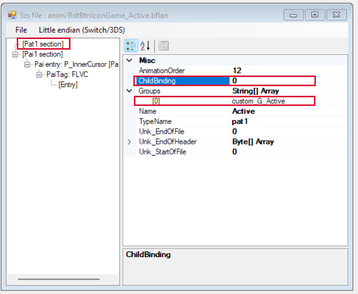
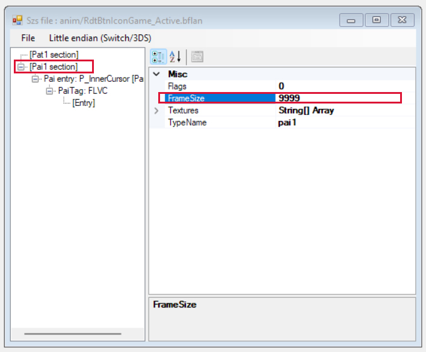

##### :octicons-arrow-left-16: [Back to Animations: refresher course](refresher.md)

# Animations: Main tutorial
---

## Our goal

From now on, I'll only focus on creating an animation for the game icons on the home screen. **I want those icons to
scale up when they are being selected, and to scale down to their initial size when the cursor goes off. This will be
our goal throughout this tutorial section.** As I mentioned in the introduction section, tables will be provided later
on if you want to experiment further and make more exotic animations.

## Organizing our workflow

To keep track on what we are doing, we'll first properly set up our workspace. Here I suggest a directory hierarchy that
makes my own workflow efficient enough, but you can do as you please as you get the hang of knowing what you're doing.

**1-**

Create a directory on your desktop and name it `animEdit`.

**2-**

Go in `themes/systemData` on your Switch's SD card. Since I'm interested in editing the home screen for this example, I'll only grab `ResidentMenu.szs`.

**3-**

Copy `ResidentMenu.szs`, paste it on your desktop and in `Desktop/animEdit`.

|  |  |
|---------------------------------------|-----------------------------------------------|
| `Desktop/`                            | `Desktop/animEdit`                            |

Remember, we'll need one vanilla `.szs` and one copy of it that we'll edit, so we can diff them at the end. Here the
desktop one will remain vanilla, so we will edit the one in `Desktop/animEdit`.

## Animation creation process

**4-**

Open Layout Editor and load up `animEdit/ResidentMenu.szs`. You can simply drag and drop the file onto the window. A little box will open listing all the files contained in the `.szs` archive.

**5-**

First, we will create the scaling up animation when the game icon is **selected**. In the box window, search for `RdtBtnIconGame_Active.bflan` and open by double clicking. A new window will show up. On this window, expand all the items by clicking the `+` icons.

On the left are listed *some* panes contained in `RdtBtnIconGame.bflyt` (actually only one in this case,
namely `P_InnerCursor`). Depending on what we want to achieve, we'll likely need to add more panes to this list. That
will be the case here for our example.

On the right are displayed items that are used to define the animation behavior. Don't worry, we'll only need to edit a
few of them.

Now I apologize in advance, but you'll need to blindly follow my instructions... for now. I will elaborate some of them
throughout this section.

**6-**

In the left panel, click on the first entry, `Pat1 section`. Then on the right panel,

- Set `AnimationBinding` to `0`

- Expand the `Groups` entry by clicking on the left arrow, and set the `[0]` field to `custom_G_Active` (the value isn't relevant here so this actually can be anything).

- In the left panel, click on the second entry, `Pai1 section` and set the `FrameSize` to `9999`.

!!! warning
      This 6th step is a recurring setup that always needs to be done in order to create **any kind of animation**, regardless of our current goal.

If you've done everything correctly, this should look like this.

|  |  |
|-------------------------------------------|-------------------------------------------|
| `Pat1 section`                            | `Pai1 section`                            |

      
Now about creating our actual animation, we will do so by editing the `N_Root` pane from `RdtBtnIconGame.bflyt`, which means adding an entry to the pane list.

!!! tip
      If you are familiar with theming, `N_Root` is the pane that basically contains all the others within the `.bflyt`. Thus here we won't bother and we will animate the whole thing (including text, cursor, etc.). But you can be more specific and animate, for example, only the game title text. In this very case, you would add the `L_Balloon` entry instead.

**7-**

To add the `N_Root` pane to the list, left click AND THEN right click on the `Pai1 section` (otherwise
   you'll encounter unexpected behavior). Select the `Add Entry` option. The left panel should update with the newly
   added item at the end of the list. Click on it and rename it as `N_Root` in the right panel.

| ") | ") |
|-----------------------------------------------------|-----------------------------------------------------|
| Adding a pane (1)                                   | Adding a pane (2)                                   |

**8-**

Right click on `N_Root` in the pane list and select `Add Entry`. Expand the `N_Root` pane and rename the `PaiTag`
   entry as `FLPA`. Then again, add *2 sub-entries* to the `FLPA` entry.

Now, the following steps will define the scaling up animation we want to achieve.

**9-**

Under `FLPA`, select the first `[Entry]`. The right panel will display another set of values. Some of them will actually matter, so please take note of these,

- `AnimationTarget` is the type of animation we choose to assign to our pane. This is basically here that we tell the pane to either scale up or down, translate along the x-axis or y-axis, or rotate around the z-axis clockwise/counterclockwise. Later on, this is where you might be interested in checking the tables to test the values associated to other types of animations.

- `KeyFrames` is... self-explanatory, I guess. This allows us to break our animation down into properly defined key frames.
    
- `DataType` refers to the type of our inputs in the `KeyFrames` field. **Just keep in mind that it should always be set to `2`** (meaning `float`). Although it's not really relevant here, you can follow [this link](https://layoutdocs.themezer.net/guide/layouts/usd-sections/) if you want to know a little more.

**10-**

We will define our values as,

- `AnimationTarget` = `6`

- `DataType` = `2`

Leave the rest unchanged. Value `6` for `AnimationTarget` means *"scale along the x-axis"* (horizontally).

**11-**

Select the `KeyFrames` item and click on the dots button that shows up. A new window will pop up in which we can add our key frames using the `Add` / `Remove` buttons at the bottom. Do as shown below.

")

This is how you should read this: at frame `0`, value is `1`, meaning that at the initial frame, the `N_Root` pane will
keep its base ratio **along its horizontal axis**. Then, **up until frame `8`**, the pane will *progressively* scale up
until reaching a `1.4` factor.

!!! tip
      Note that we defined earlier the `FrameSize` to be `9999` in the `Pai1 section`. We're good as long as this value is superior to the `Keyframe` maximum value, which is `8` here.

!!! cite "Blend value"
      `Blend` refers to the function's slope (as in math function) that guides the animation. In layman's terms, it conditions the pace at which a pane will travel from one frame to another. Since `Blend` values aren't documented and hard to figure out, I won't bother at all about them. I personally always set this value to `0`, which seems to represent a linear function, but feel free to experiment (and perhaps contribute to this guide).

**12-**

Repeat the 9th, 10th and 11th steps to the second `[Entry]` under `FLPA`, but the `AnimationTarget` value should be `7` here instead of `6`, meaning *"scale along the y-axis"* (vertically).

Now with all of these steps, we successfully made a scaling up animation when the game icon is **selected**. But what
about when the icon is **being unselected**? Well, Switch's UI also offers us the possibility to tamper with that. If
not done, the icon will actually keep its `1.4` factor **even after being unhovered**. So if we want to get things done
properly, what follows is pretty much a mandatory thing to do. So, back to square one,

**13-**

Go back to the little box window that lists the `.szs` content and search for `RdtBtnIconGame_Inactive.bflan`. Open this file and repeat all the steps above starting from step 6. **At step 6.b., change the `[0]` value to `custom_G_Inactive`** (it doesn't actually matter but it's for convenience). For the animation, we will do things the other way around, so step 12 should look like this.

")

This way, the game icon will scale down to its initial size when being unselected.

Now, there is a last thing we must do before diffing, **adding groups**. More precisely, adding groups to
the `RdtBtnIconGame.bflyt` file in this case. This is necessary to 1) prevent crashes that will very likely happen
without doing so, and 2) order the `.bflyt` to not follow its vanilla animation. Basically, we need to create a group for each `.bflan` we tampered with,
namely `RdtBtnIconGame_Active.bflan` and `RdtBtnIconGame_Inactive.bflan`.

**14-**

Go back to the `.szs` box window and open up `RdtBtnIconGame.bflyt`. Don't mind the gray area on the right, just add a new group as shown in the image below, and make sure to **rename it the same name as we defined in step 6** (i.e. `custom_G_Active`). Then select the `Panes` item in the rectangle area below the list and type the panes listed in the `RdtBtnIconGame_Active.bflan` file. Each pane must be separated by a line break.

| ") | ") |
|---------------------------------------|----------------------------------------|
| Adding a group                        | Enumerating panes in the group         |

**15-**

Repeat the operation for `RdtBtnIconGame_Inactive.bflan`. Same process except the group needs to be called `custom_G_Inactive`.

And with this, we are mostly done. Now is finally the time for diffing. **Make sure to save the edits in all the opened
windows.**

**16-**

Go back to the `.szs` box window, select `Tools` in the top menu, then the `This is the edited szs` option. You'll be prompted with a new window. Browse the unedited `ResidentMenu.szs` that we've been keeping in `Desktop/`, leave the checkbox as it is and click on `Generate diff`.

This will output a `.json` file we will be using to compile a `.nxtheme` with Switch Theme Injector. Finally done!

(the hovered game icon scaling has been reduced to `1.2` since it was overlapping and I also hid the game title text)

!!! tip
      Checking the output `.json`, you can see that groups were added at the end of the `RdtBtnIconGame.bflyt` section. There is also an added `Anims` section at the very end of the code. Theoretically you could totally make animations without using Layout Editor at all, but I don't recommend this option as the text formatting of the `Anims` section is quite messed up and unintelligible, although it's fine for minor adjustments.

      |  |  |
      |------------------------------------------------------|----------------------------------------------|
      | `AddGroups` section                                  | `Anims` section                              |

# [Continue to Animations: templates](anim-templates.md) :octicons-arrow-right-16: