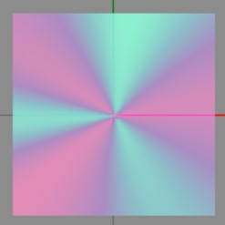
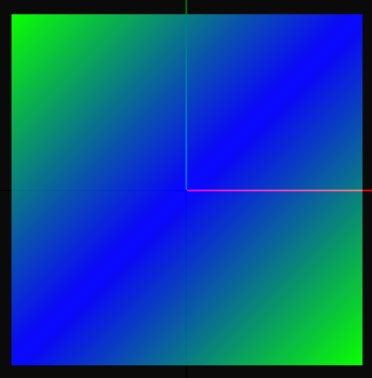

You've made a theme and all that is left is to make the cursor match the style.
The cursor exists of two panes: `P_Main` and `P_Grow`. These can be found in `Cursor3.bflyt` (every `szs` has one). `P_Grow` is positioned on top of `P_Main` and both are always enabled.


_The two layers P_Main (left) and P_Grow (right) separated_

<!-- prettier-ignore -->
!!! Info
	Note that

    - BackgroundColor (Switch Layout Editor) == White Color (Switch Toolbox)
    - ForegroundColor (Switch Layout Editor) == Black Color (Switch Toolbox)

    These two fields can be found under the Materials section in both programs.

The cursor color is actually set in two ways:

## 1. Material Color

The material colors are what is visible in the gif. The following are the default values:

`P_Main`

-   BackgroundColor/White Color: <span class="color-text" markdown="1">`rgba(0,193,242)`</span>
-   ForegroundColor/Black Color: <span class="color-text" markdown="1">`rgba(0,221,165)`</span>

`P_Grow`

-   BackgroundColor/White Color: <span class="color-text" markdown="1">`rgba(22,158,244)`</span>
-   ForegroundColor/Black Color: <span class="color-text" markdown="1">`rgba(0,204,44)`</span>

## 2. USD Color

Both panes also have a USD section with `C_W` and `C_B` set. The following are the default values:

-   `P_Main`
    -   `C_B`: `37`
    -   `C_W`: `65`
-   `P_Grow`
    -   `C_B`: `38`
    -   `C_W`: `29`

The USD Color actually overwrites the Material color. This way the material color can dynamically change based on the system theme (White/Black).

---

## Examples (Simple)

<!-- prettier-ignore -->
!!! Important
	-   Since the color format is actually `aabbggrr` (alpha, blue, green, red) you'll have to use a reversed version of the normal hex color. For example, the hex color code `FF0000` (rgb)/`FF0000FF` (rgba) would become `FF0000FF` (abgr).

### Stock Animation, Custom Colors

This example keeps the stock animation and only changes the colors.  
You need four colors: two base colors and two slightly lighter variants (see [Setting a custom color, step 2](#setting-a-custom-color#:~:text=0%2C%200%5D%20Next-,Set%20you%20custom,-colors%20in%20the))

<!-- prettier-ignore -->
!!! Warning
	**DO NOT** change the alpha channel in this example (keep the `FF` and `00`). Only modify lowercase `bbggrr`.

```json
{
	"TargetName": "ResidentMenu.szs",
	"Files": [
		{
			"FileName": "blyt/Cursor3.bflyt",
			"Patches": [
				{
					"PaneName": "P_Main",
					"UsdPatches": [
						{
							"PropName": "C_B",
							"PropValues": ["0", "0", "0", "0"],
							"type": 1
						},
						{
							"PropName": "C_W",
							"PropValues": ["0", "0", "0", "0"],
							"type": 1
						}
					]
				},
				{
					"PaneName": "P_Grow",
					"UsdPatches": [
						{
							"PropName": "C_B",
							"PropValues": ["0", "0", "0", "0"],
							"type": 1
						},
						{
							"PropName": "C_W",
							"PropValues": ["0", "0", "0", "0"],
							"type": 1
						}
					]
				}
			],
			"Materials": [
				{
					"MaterialName": "P_Grow",
					"BackgroundColor": "FFbbggrr", // set your first color here
					"ForegroundColor": "00bbggrr" // set your second color here
				},
				{
					"MaterialName": "P_Main",
					"BackgroundColor": "FFbbggrr", // set the slightly lighter variant of your first color here
					"ForegroundColor": "00bbggrr" // set the slightly lighter variant of your second color here
				}
			]
		}
	]
}
```

#### Result


### No Animation, Two Colors

This example disables the animation, but still shows two colors.  
You need Two colors color.

<!-- prettier-ignore -->
!!! Warning
	**DO NOT** change the alpha channel in this example (keep the `FF` and `00`). Only modify lowercase `bbggrr`.

```json
{
	"TargetName": "ResidentMenu.szs",
	"Files": [
		{
			"FileName": "blyt/Cursor3.bflyt",
			"Patches": [
				{
					"PaneName": "P_Main",
					"UsdPatches": [
						{
							"PropName": "C_B",
							"PropValues": ["0", "0", "0", "0"],
							"type": 1
						},
						{
							"PropName": "C_W",
							"PropValues": ["0", "0", "0", "0"],
							"type": 1
						}
					]
				},
				{
					"PaneName": "P_Grow",
					"Visible": false
				}
			],
			"Materials": [
				{
					"MaterialName": "P_Main",
					"BackgroundColor": "FFbbggrr", // set your first color here
					"ForegroundColor": "00bbggrr" // set your second color here
				}
			]
		}
	],
	"Anims": [
		{
			"FileName": "anim/Cursor3_Wait.bflan",
			"AnimJson": "{\"LittleEndian\":true,\"Version\":150994944,\"pat1\":{\"AnimationOrder\":0,\"Name\":\"Wait\",\"ChildBinding\":90,\"Groups\":[\"G_Wait\"],\"Unk_StartOfFile\":0,\"Unk_EndOfFile\":0,\"Unk_EndOfHeader\":\"ACoDAAAAAA==\"},\"pai1\":{\"FrameSize\":720,\"Flags\":1,\"Textures\":[],\"Entries\":[]}}"
		}
	]
}
```

#### Result



### No Animation, Custom Colors

This example disables the animation and changes the cursor to be one or more colors. You can get creative since you can modify the four corners individually.  
You need one or more colors.

<!-- prettier-ignore -->
!!! Info
	Note that the `ColorXX` fields mean the following:

    - TL = Top Left
    - TR = Top Right
    - BL = Bottom Left
    - BR = Bottom Right

<!-- prettier-ignore -->
!!! Warning
	**DO NOT** change the alpha channel in this example (keep the `FF`). Only modify lowercase `bbggrr`.

```json
{
	"TargetName": "ResidentMenu.szs",
	"Files": [
		{
			"FileName": "blyt/Cursor3.bflyt",
			"Patches": [
				{
					"PaneName": "P_Main",
					"UsdPatches": [
						{
							"PropName": "C_B",
							"PropValues": ["0", "0", "0", "0"],
							"type": 1
						},
						{
							"PropName": "C_W",
							"PropValues": ["0", "0", "0", "0"],
							"type": 1
						}
					],
					"ColorTL": "FFbbggrr", // set your custom color(s) in these four fields
					"ColorTR": "FFbbggrr",
					"ColorBL": "FFbbggrr",
					"ColorBR": "FFbbggrr"
				},
				{
					"PaneName": "P_Grow",
					"Visible": false
				}
			],
			"Materials": [
				{
					"MaterialName": "P_Main",
					"BackgroundColor": "FFFFFFFF",
					"ForegroundColor": "00FFFFFF"
				}
			]
		}
	]
}
```

#### Result

  
_Color value: `FF0000FF` (red)_

__  
Color values respectively: `FF00FF00`, `FFFF0000`, `FFFF0000`, `FF00FF00`

## Instructions (Advanced)

I recommend you use the Switch Toolbox if you want to mess with it yourself (In LayoutKit: `Settings > Preferred editor > Switch-Toolbox`). It can preview what your animation will look like. If you don't, there are a few examples further down this page.

1. The first thing to do for a custom cursor is disable the USD effects. Change the `C_B` and `C_W` for `P_Main` and `P_Grow` to `[0, 0, 0, 0]`
   Next
2. Set you custom colors in the `P_Grow` materials. Set `P_Main` to a slightly lighter variant of your colors. For example,

    - `P_Main`
        - BackgroundColor/White Color: <span class="color-text" markdown="1">`rgba(40,224,161)`</span>
        - ForegroundColor/Black Color: <span class="color-text" markdown="1">`rgba(229,43,183)`</span>
    - `P_Grow`
        - BackgroundColor/White Color: <span class="color-text" markdown="1">`rgba(10,179,121)`</span>
        - ForegroundColor/Black Color: <span class="color-text" markdown="1">`rgba(180,10,134)`</span>

    You always want to the ForegroundColor/Black Color to have opacity `0` (default). If it doesn't, the middle (so it covers the whole button instead of just the edge) of the cursor will be filled with the color as well.

---
